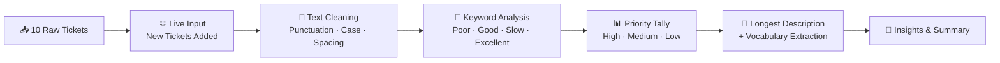

# 🎫 Customer Support Ticket Analyzer
## *Turning Raw Support Tickets Into Priority & Sentiment Insights — Pure Python, No Shortcuts*

  

   

 

## 🗺️ Table of Contents

| | | |
|:---:|:---:|:---:|
| 🎯 [Project Overview](#-project-overview) | 🔄 [The Process](#-the-process--how-this-came-together) | 🗂️ [Repository Structure](#-repository-structure) |
| 📊 [Dataset at a Glance](#-dataset-at-a-glance) | 🧭 [Methodology](#-methodology--section-by-section) | 💡 [Key Insights](#-key-insights) |
| 🔍 [Findings Deep-Dive](#-findings-deep-dive) | 🏢 [Business Value & Outlook](#-business-value--future-outlook) | 📸 [On Visualization](#-on-visualization) |
| 🧠 [Skills Applied](#-skills-applied) | 🚀 [About Me](#-about-me) | 📫 [Let's Connect](#-lets-connect) |

---

## 🎯 Project Overview

Every support team drowns in the same question: *what are our customers actually telling us, and where should we focus first?* This project tackles that question using nothing but core Python — no Pandas, no NumPy, no external libraries — to prove that solid analytical thinking doesn't require heavy tooling to produce real answers.

Starting from **10 raw customer support tickets**, this analyzer cleans messy real-world text (inconsistent punctuation, capitalization, spacing), accepts new tickets through live user input with validated priority levels, and then mines the cleaned data for patterns: which keywords show up most, how priority levels are distributed, which customer had the most to say, and what the full vocabulary of customer complaints actually looks like.

The point of building this in raw Python first — dictionaries, loops, string methods — was to genuinely understand *what* Pandas automates later, rather than treating it as a black box. Every function here (`clean_text`, `count_tickets_with_word`) was written by hand, tested against real edge cases, and debugged when it didn't behave as expected.

---

## 🔄 The Process — How This Came Together

### 🧹 Data Cleaning
Raw ticket descriptions arrived inconsistent — mixed case, stray punctuation, extra whitespace, and shorthand like "ok" instead of "okay." A custom `clean_text()` function was built to standardize every description: lowercasing, stripping `! . , ? -`, collapsing repeated spaces, and normalizing shorthand, so keyword matching downstream would actually be reliable.

### 📥 Data Collection & Expansion
Rather than working with a static, closed dataset, the analyzer accepts **live input** to add new tickets — with a validation loop that refuses to accept a Priority value outside High/Medium/Low and keeps re-prompting until it gets one. This mirrors how real intake systems have to handle imperfect human input.

### 🔍 Exploration & Keyword Analysis
With clean text in hand, the analysis moves into pattern-finding: counting how often specific sentiment-carrying words ("poor," "good," "slow," "excellent") appear across all tickets, tallying tickets by priority level, and identifying the single longest issue description by word count.

### 📚 Vocabulary Analysis
As a final layer, every unique word across all cleaned descriptions was collected into a set, giving a complete, deduplicated vocabulary of how customers actually describe their problems — a foundation that could later feed into more advanced text analysis.

---

## 🗂️ Repository Structure

**The pipeline, visually:**

---

## 📊 Dataset at a Glance

| Metric | Value |
|---|---|
| Starting Records | 10 tickets |
| Final Records (after live input test) | 11 tickets |
| Fields per Ticket | 4 *(Ticket_No, Customer_Name, Issue_Description, Priority)* |
| Priority Categories | 3 *(High, Medium, Low)* |
| Total Unique Words (cleaned) | 31 |
| Data Structure Used | Python dictionary of lists (manual table) |

---

## 🧭 Methodology — Section by Section

**1. Data Initialization**
Built the starting dataset as a dictionary of parallel lists — one list per field, indexed consistently across all 10 tickets. This structure was a deliberate choice: it forces you to think in terms of rows and columns manually, the exact mental model Pandas automates later. Printing the raw data first established a clear "before" state to compare against after cleaning.

**2. Interactive Ticket Intake**
Added a live `input()`-driven loop letting new tickets get appended to the same structure, with the next ticket number calculated automatically rather than hardcoded. A validation `while True` loop refuses to accept anything outside High/Medium/Low for priority, re-prompting until valid input is given — a small but important detail that mirrors real-world data entry safeguards.

**3. Text Cleaning Function**
Wrote `clean_text()` to standardize every issue description: lowercase conversion, punctuation stripping, whitespace normalization, and a shorthand fix converting "ok" to "okay." This function was applied across every existing description in a loop, transforming the entire dataset in place before any analysis touched it.

**4. Keyword & Sentiment Counting**
Built `count_tickets_with_word()` to scan every cleaned description for a target keyword and return how many tickets mention it. Ran this for four sentiment-carrying words — poor, good, slow, excellent — giving a lightweight but genuinely useful sentiment signal without needing any NLP library.

**5. Priority, Length & Vocabulary Analysis**
Closed the analysis with three final passes: a manual tally of tickets per priority level using simple counters, a loop to find the single longest issue description by word count, and a `set()`-based extraction of every unique word across the entire cleaned dataset — giving a complete, deduplicated view of customer vocabulary.

---

## 💡 Key Insights

- **Priority distribution is nearly balanced** — High (4), Medium (4), and Low (3) tickets show no single urgency level dominating, meaning support resourcing needs to stay flexible across all three tiers rather than concentrating on one.
- **Positive language slightly outweighs negative language** — "good" appeared in 3 tickets versus "poor" and "slow" at 2 each, suggesting service sentiment leans mildly favorable even within a small sample.
- **One ticket stood out as the most detailed complaint** — Ticket #2 (Meera) contained the longest issue description at 5 words, flagging it as a candidate for closer manual review.
- **The vocabulary is compact but meaningful** — 31 unique words across all descriptions shows customers tend to describe issues in short, similar language, which is exactly the kind of pattern that scales well to keyword-based triage.
- **Text cleaning was essential, not optional** — without standardizing case, punctuation, and spacing first, keyword counts like "poor" or "good" would have under-counted matches hidden behind capitalization or stray punctuation.

---

## 🔍 Findings Deep-Dive

| Category | Metric | Value | What It Signals |
|---|---|:---:|---|
| Priority | High Priority Tickets | 4 | Roughly a third of all tickets need urgent attention |
| Priority | Medium Priority Tickets | 4 | Matches High exactly — no single tier is being neglected |
| Priority | Low Priority Tickets | 3 | Slightly smaller share, but still meaningful volume |
| Keyword | "Poor" mentions | 2 | Direct negative sentiment signal, worth investigating specifically |
| Keyword | "Good" mentions | 3 | Most frequent sentiment word — a mildly positive lean |
| Keyword | "Slow" mentions | 2 | Recurs alongside "poor," hinting response-time may be a theme |
| Keyword | "Excellent" mentions | 1 | Rare, but shows some tickets reflect genuinely strong service |
| Vocabulary | Unique Words | 31 | A compact, consistent vocabulary across all customer language |

---

## 🏢 Business Value & Future Outlook

Even without a single external library, this analysis mirrors exactly what a real support operations team needs on day one: a fast read on where urgency is concentrated, and a lightweight way to flag sentiment without waiting on a full NLP pipeline. The near-even split across High, Medium, and Low priority tickets is itself a useful operational signal — it means a support team can't just staff up for "the busy tier," because there isn't one dominant tier here.

The keyword counts, simple as they are, hint at something worth watching: "poor" and "slow" appearing together across multiple tickets suggests response-time complaints and quality complaints may be linked rather than separate issues — worth confirming with a larger sample. Looking ahead, the natural next step is **scaling this exact logic onto a real, larger ticket dataset using Pandas**, adding actual visualizations (a priority bar chart, a keyword frequency chart) and potentially a genuine sentiment score instead of hand-picked keywords — turning this proof-of-concept into a dashboard-ready tool.

---

## 📸 On Visualization

Unlike my larger analytics projects, this one was intentionally built using **only core Python** — no Matplotlib, Seaborn, or Pandas — to focus purely on the underlying logic before reaching for visualization libraries. There are no charts in this version by design.

*Planned enhancement: adding a Matplotlib bar chart for priority distribution and a keyword-frequency chart would be the natural next iteration of this project — turning the printed insights above into something visual.*

---

## 🧠 Skills Applied

- **Manual Data Structuring** — building and indexing a dictionary-of-lists as a working table, the exact foundation Pandas automates later, showing the logic isn't just memorized syntax.
- **Defensive Input Handling** — validating live user input with a retry loop instead of trusting it blindly, a habit that matters far beyond this one project.
- **Custom Text Normalization** — writing a cleaning function from scratch rather than relying on a library, forcing a real understanding of what "clean text" actually requires.
- **Debugging Discipline** — testing functions against edge cases (like words containing "ok" as a substring) rather than assuming correctness just because the sample data happened to pass.

## 📚 Skills Sharpened Along the Way

- Writing **pure-Python string manipulation** logic instead of reaching for a library shortcut
- Building **input validation loops** that handle bad user input gracefully instead of crashing
- Using **sets** correctly for deduplication — an underused but efficient Python data structure
- Thinking in terms of **rows and fields manually**, which made learning Pandas afterward click much faster

---

## 🚀 About Me

I'm **Bernad** — transitioning from a background in medical billing into data analytics, one hands-on project at a time. B.Sc. in Mathematics, and a firm believer that understanding core Python deeply makes every library built on top of it make more sense.

| 🔧 Skill Area | 🌟 Tools |
|---|---|
| 🐍 Core Programming | Python (Dictionaries, Loops, Functions, Sets) |
| 📊 Data Analysis (Advancing To) | Pandas, NumPy |
| 📈 Visualization (Advancing To) | Matplotlib, Seaborn, Plotly |
| 🗄️ Business Intelligence | Power BI, DAX, Power Query |
| 📑 Spreadsheet Analysis | Excel (Pivot Tables, SUMIFS/COUNTIFS) |
| 🧠 Core Strength | Turning Raw, Messy Text Into Structured Insight |

My approach is simple: **understand the logic by hand before reaching for the shortcut** — because that's genuinely how I learn it well enough to explain it to someone else.

---

## 📫 Let's Connect

⭐ **If this project helped you see the logic behind Pandas, a star would mean a lot.**

